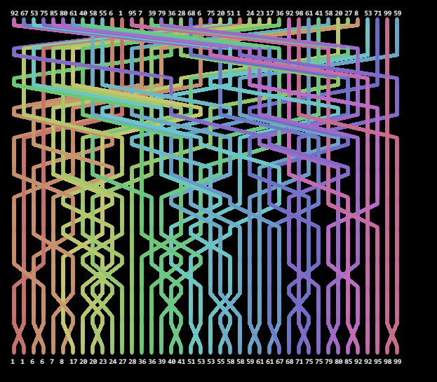

# Rainbow Animations

This repository contains a rainbow animation illustration/animation library, inspired by this article: https://bost.ocks.org/mike/algorithms/

This project has no requirements/dependencies.

Example usage is provided in 'shell_sort.js', where I use the library to animate a shell sorting algorithm.

Demo at: https://sudonym-i.github.io/rainbow_animations/

Enjoy! 🌈