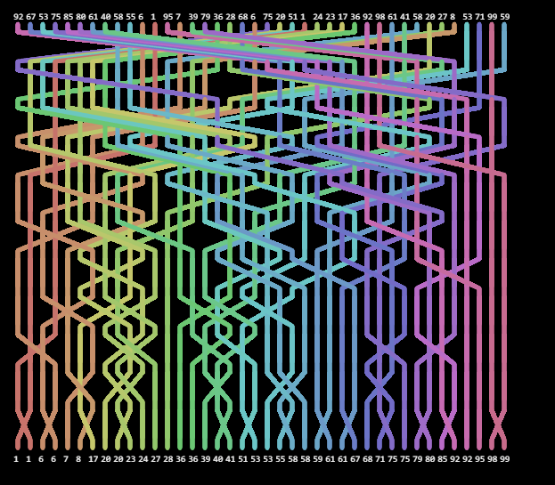

# Rainbow Animations

### Introduction

This repository contains a rainbow animation illustration/animation library, inspired by this article: https://bost.ocks.org/mike/algorithms/

*This project has no requirements/dependencies.*

Example usage is provided in `shell_sort.js`, where I use the library to animate a shell sorting algorithm.

Demo at: https://sudonym-i.github.io/rainbow_animations/

## Usage

Usage is documented in [rainbow_animate.js](rainbow_animate.js). The inline documentation alognside the required variables expresses the usage of this library better than I cuold do here.

Enjoy! 🌈
